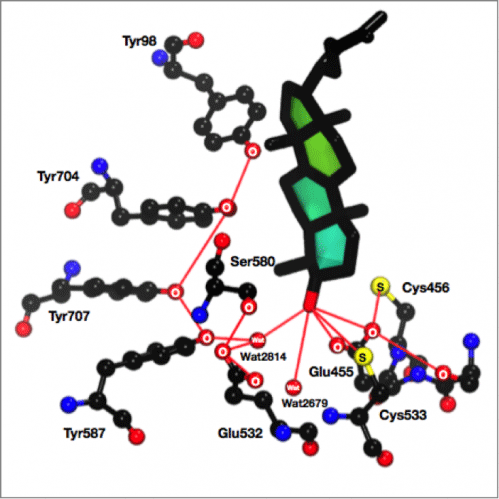
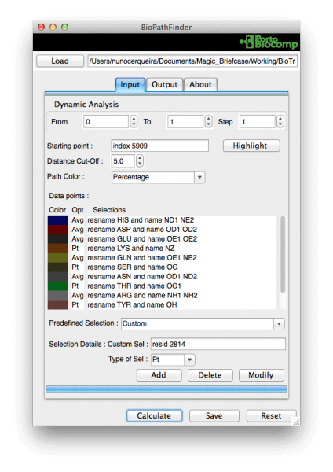
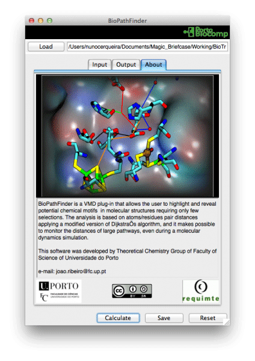
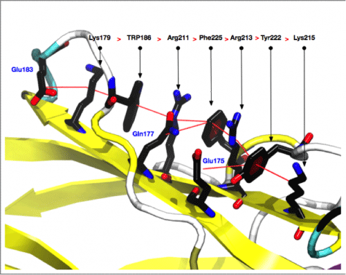

# Introduction
Chem-Path-Tracker is a bioinformatic tool that allows to locate functionally relevant chemical motifs in protein structures.

The chemical motifs can be a small group of residues or structure protein fragments with highly conserved properties that have important biological functions. However, the detection of chemical motifs is rather difficult because they often consist of a set of amino acid residues separated by long, variable regions, and they only come together to form a functional group when the protein is folded into its three dimensional structure. Furthermore, the assemblage of these residues is often dependent on non-covalent interactions among the constituent amino acids that are difficult to detect or visualize. To simplify the analysis of these chemical motifs and give access to a generalized use for all users, we developed Chem-Path-Tracker.

Chem-Path-Tracker is a VMD plug-in that allows the user to highlight and reveal potential chemical motifs requiring only a few selections. The analysis is based on atoms/residues pair distances applying a modified version of Dijkstra’s algorithm, and it makes possible to monitor the distances of a large pathway, even during a molecular dynamics simulation.

## Minimum Requirements

Operating System: macOS, Linux or Windows
Visual Molecular Dynamics (VMD) 1.9.1 or later

## Installation

You could install Chem-Path-Tracker through [vmdStore](https://github.com/BioSIM-Research-Group/vmdStore) (Recommended).

## Contacts
If you have any suggestion of new features, please contact us: nscerque@fc.up.pt

## Citation
Ribeiro, J. V., Cerqueira, N. M. F. S. A., Fernandes, P. A. and Ramos, M. J. (2014), chem-path-tracker: An Automated Tool to Analyze Chemical Motifs in Molecular Structures. Chem Biol Drug Des, 84: 44–53.

## DOI
https://doi.org/10.1111/cbdd.12349
